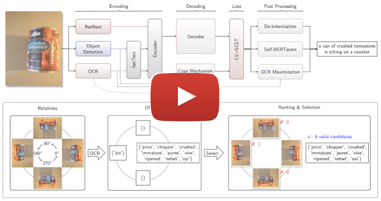
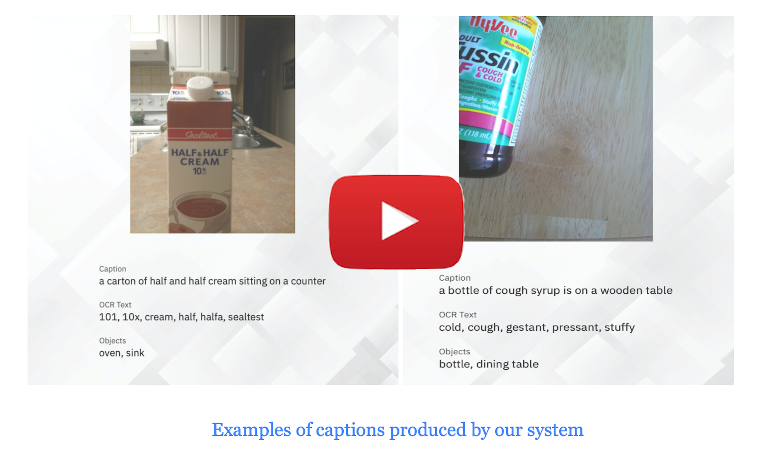

# Winning Entry to the 2020 VizWiz Grand Challenge
Image Captioning as an Assistive Technology: Lessons Learned from VizWiz 2020 Challenge.
***

## Resources

### Multimodal Assistive Captioner System

#### Real-Time Demo (Video Length: ~2 mins)

#### Presentation (Video Length: ~5 mins)

***

## Citations
